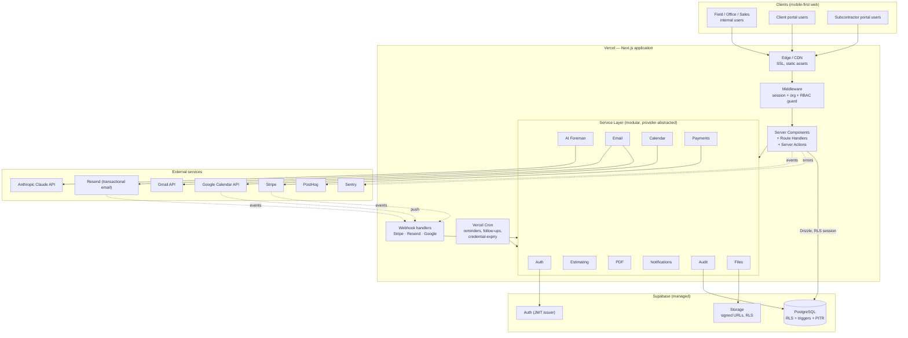
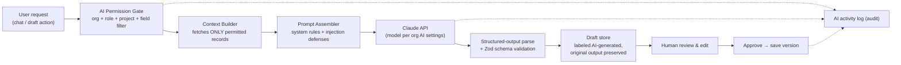
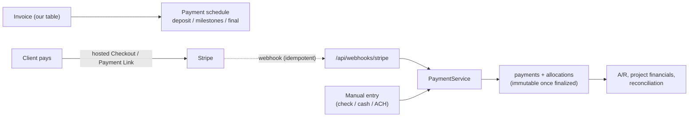

# PT's Tactical Foreman — System Architecture (Task 3)

| | |
|---|---|
| **Document version** | 1.0 |
| **Date** | 2026-07-21 |
| **Status** | Draft — pending owner approval |
| **Basis** | `docs/PRD.md` v1.0, `docs/tech-stack.md` v1.0 |

This is the technical architecture for PT's Tactical Foreman. It translates the PRD's requirements and the approved stack into concrete component boundaries, data flows, and operational procedures. No application code is generated in this task.

**Guiding principle (from the PRD):** the platform is multi-tenant and security is enforced *at the database layer* (row-level security), not by UI hiding or app-code checks alone. Every architectural decision below serves that, the AI-drafts-humans-approve rule, and financial-record immutability.

---

## 1. Architecture at a Glance



The application is a single deployable Next.js unit. Its internal **service layer** is the seam that keeps external providers swappable (the PRD's modularity rule) — route handlers and server components never call Stripe/Claude/Google SDKs directly; they call `PaymentService`, `AiService`, `CalendarService`, etc.

---

## 2. Frontend Architecture

**Rendering model.** Next.js App Router with React Server Components as the default. Data-heavy, read-mostly screens (dashboards, project workspace tabs, lists) render on the server so the phone downloads HTML, not a large client bundle — critical for jobsite connections. Client Components are used only where interactivity demands it (forms, the AI Foreman chat, photo capture, signature pad, live filters). This keeps the mobile bundle small and first paint fast.

**Route groups** (mapping to PRD navigation):
- `(app)` — authenticated internal app: dashboard, leads, clients, projects, estimates, proposals, schedule, tasks, documents, financials, AI Foreman, settings.
- `(portal-client)` — client portal, structurally separate layout and data boundary.
- `(portal-sub)` — subcontractor portal, structurally separate.
- `(auth)` — login, register, reset, verify, invitation acceptance.

Separate route groups for the portals are a deliberate isolation boundary: portal code paths never import internal-app data loaders, reducing the chance of a portal user ever reaching internal queries.

**Component system.** Tailwind + shadcn/ui (owned in-repo). A small set of composed primitives enforces the PRD's mobile requirements consistently:
- **App shell** — desktop sidebar; mobile bottom nav with a thumb-zone quick-create FAB; header with org name, user, notifications, global-search placeholder.
- **State primitives** — every data surface ships loading, empty, and error states (PRD acceptance + Task 7).
- **Field-input primitives** — large tap targets (≥44px), camera/gallery/voice-note capture, autosave wrappers for long forms (intake, daily logs).

**Client state & data.** Server state comes from RSC loaders and Server Actions; where the client needs to mutate-and-revalidate (chat, autosave, optimistic task updates) we use React's `useOptimistic`/`useTransition` plus Server Actions, falling back to TanStack Query only where a genuinely interactive cache is needed. Form state via React Hook Form + Zod resolvers so the *same* Zod schema validates on client and server.

**Offline posture (MVP).** PWA-installable, small payloads, resumable media uploads, clear retry states. Full offline write queue is post-MVP but the Server-Action mutation boundary is designed so an offline queue can wrap it later without reworking screens.

---

## 3. Backend Architecture

**Shape.** There is no separate backend service. The backend is Next.js Route Handlers (`app/api/**` for webhooks, portal tokens, file streaming, and any REST needed by future native apps) and Server Actions (the primary mutation path for the web UI). Both are thin: they authenticate, authorize, validate, then delegate to the service layer.

**Layering (strict, one direction):**

```
Route Handler / Server Action   ← HTTP & auth boundary; no business logic
        │
        ▼
Service layer                    ← business rules, orchestration, provider abstraction
   EstimateService, ProposalService, ChangeOrderService, InvoiceService,
   PaymentService, AiService, PdfService, EmailService, CalendarService,
   NotificationService, AuditService, FileService, IntakeService, ...
        │
        ▼
Repository / data access         ← Drizzle queries, always org-scoped, RLS-backed
        │
        ▼
PostgreSQL (RLS + triggers)
```

**Why a service layer.** Three PRD demands make it non-negotiable: (1) providers must be swappable → services wrap SDKs behind interfaces; (2) financial calculations must be testable in isolation → `EstimateService`/`InvoiceService`/`ChangeOrderService` are pure, unit-tested modules independent of HTTP; (3) the AI may only *draft* → structured AI outputs flow through the same services (e.g. `EstimateService.validateDraft()`) as human input, so approval gates and schema validation apply uniformly.

**Validation.** Every entry point validates input with Zod before anything else. AI-produced structured data is validated against the *same* schemas as human input (Task 32) — there is one schema per entity, used by the form, the API, and the AI-draft path.

**Idempotency.** Webhook handlers and payment/invoice writes use idempotency keys (Stripe event IDs, our own operation IDs) so retries never double-post financial records.

**Global error handling.** A shared error type taxonomy (validation, authz, not-found, conflict, provider-failure) maps to consistent HTTP responses and user-facing states, and reports to Sentry with request/org/user context (never secrets).

---

## 4. Database Architecture

Full schema is Task 4; this section sets the rules Task 4 must implement.

**Engine.** PostgreSQL (Supabase). Drizzle ORM defines schema in TypeScript; drizzle-kit emits readable SQL migrations that also carry RLS policies, triggers, and constraints.

**Tenancy.** Every tenant table carries `organization_id`. Isolation is enforced by **Row-Level Security** keyed on the JWT's `org` claim, not by trusting app code. The app sets the request's org context (via Supabase session / `SET LOCAL`), and RLS policies do the rest — a query that forgets to filter by org still returns nothing cross-tenant.

**Conventions (binding on Task 4):**
- UUID primary keys (`gen_random_uuid()`).
- `created_at` / `updated_at` on every table; `updated_at` maintained by trigger.
- Soft delete (`deleted_at`) where business history matters; RLS excludes soft-deleted rows by default.
- Foreign keys with explicit `on delete` behavior; referential integrity enforced in-DB.
- Status fields as Postgres enums or check-constrained text.
- **Versioning** for scopes and estimates: version rows are immutable; a "current"/"approved" pointer moves.
- **Financial immutability:** finalized invoices, payments, contracts, and signed proposals are protected by triggers that reject `UPDATE`/`DELETE` on locked rows — corrections create new, linked records. This is enforced in the database so no code path (including a future bug) can silently rewrite financial history.
- **Audit:** an append-only `audit_logs` table; write path via `AuditService`; RLS makes it insert-only for normal roles and unreadable except to Owner/Admin.

**Access tiers.**
1. Postgres RLS — the hard tenant/role boundary.
2. Repository layer — always passes org scope; defense in depth and ergonomics.
3. Service/route authorization — role and field-level checks (e.g. hide cost/margin from Foreman) before data is even requested.

**Migrations & backups.** Migrations run in CI against staging before production. Supabase provides daily backups + point-in-time recovery (see §14).

---

## 5. Authentication Flow

**Provider.** Supabase Auth issues JWTs containing `sub` (user id) and custom claims for `org` (active organization) and `roles`. RLS policies read these claims.

**Internal-user registration & login:**
```
Register (email + password)
  → Supabase creates auth user (argon2/bcrypt hashing)
  → verification email (Resend) with signed token
  → user verifies → app-level `users` + membership rows provisioned
Login → Supabase validates → JWT (short-lived) + refresh token (httpOnly, secure cookie)
Password reset → signed single-use token via email → new password
Logout → session + refresh token revoked
```

**Organizations & membership.** A user belongs to one or more organizations via `organization_members` (carrying roles). The JWT's `org` claim names the *active* org; **organization switching** re-mints the session with a different `org` claim (PRD Task 6). Invitations create a pending membership with assigned roles; accepting binds it to an auth user.

**Protected routes.** Next.js middleware runs on every `(app)`/`(portal-*)` request: verifies the session, loads org + roles, and redirects unauthenticated/mis-scoped requests before any page or handler executes. This is the coarse gate; RLS is the fine gate.

**Portal authentication (clients & subcontractors).** Portal users authenticate through the same Supabase Auth but are provisioned as portal-role principals scoped to specific projects. Two entry modes:
- **Account-based** — client/sub sets a password, logs in, sees only their scoped projects.
- **Secure-link** — proposals/invoices/signature requests are reachable via a signed, expiring, single-purpose token (for "approve this proposal" flows) that grants access to exactly one resource without a full account. Tokens are single-scope, expiring, and audit-logged on use.

Portal principals can never enumerate internal users, other clients, or other projects — enforced by RLS policies specific to portal roles plus the separate route groups.

**Rate limiting & lockout.** Auth endpoints (login, reset, verify, portal-token redemption) are rate-limited; repeated failures trigger backoff/lockout to blunt credential stuffing.

---

## 6. Authorization Model

**RBAC, enforced server-side and in-DB.** Roles from the PRD: Owner/Administrator, Office Manager, Estimator, Project Manager, Field Foreman, Technician/Laborer, Sales Representative, Client (portal), Subcontractor (portal). A user's effective permissions are the **union** of their granted roles.

**Three enforcement layers (all must agree):**
1. **Route/middleware** — is this principal allowed on this route at all?
2. **Service authorization** — can this role perform this action on this record, given project assignment? (e.g. a PM acts only on assigned projects.)
3. **Row-Level Security** — the database itself refuses out-of-scope rows, so even a missed check in layers 1–2 cannot leak data.

**Field-level restrictions.** Some fields (internal cost, margin, employee notes, internal AI analysis) are hidden from certain roles even when the record is visible. Implemented by (a) role-scoped serializers/DTOs in the service layer that omit restricted fields, and (b) separate database views or column-level policies for the most sensitive financial columns, so a Foreman opening a project genuinely cannot retrieve its margin.

**Granular grants.** The Owner can grant additional permissions beyond a base role (e.g. give Office Manager invoice-finalization). Modeled as optional permission grants layered on role defaults; all permission changes are audit-logged with before/after.

**Assignment-scoped access.** PM/Foreman/Tech/Sub access is further narrowed to projects they're assigned to via `project_team_members` / subcontractor assignment tables; RLS policies join through these.

---

## 7. API Structure

**Two surfaces:**
- **Server Actions** — the web UI's mutation path (create lead, save estimate version, submit daily log). Co-located with features, typed end-to-end, Zod-validated. Preferred for first-party web because there's no hand-written client and no serialization boilerplate.
- **Route Handlers (`app/api/**`)** — for anything that isn't a same-origin web mutation:
  - `POST /api/webhooks/stripe`, `/api/webhooks/resend`, `/api/webhooks/google` — signed, idempotent.
  - `GET /api/files/[id]` — authorized, signed-URL redirect / stream for documents and photos.
  - `POST /api/portal/[token]/...` — secure-link portal actions (view, approve, sign, pay).
  - `/api/ai/...` — AI Foreman streaming endpoint (SSE) and structured-action drafting.
  - A versioned `/api/v1/**` REST surface (thin, reusing services) is reserved for the future native app — not built in MVP but the service layer makes it a small addition.

**Conventions.** Consistent envelope for errors; idempotency keys on financial writes; pagination on list endpoints; every handler resolves org + roles first. Rate limiting on public/portal endpoints.

---

## 8. AI Service Layer

The AI layer is a first-class, safety-gated subsystem — the PRD's hard rules are enforced here structurally, not by prompt wording alone.



**Permission gate.** Before any context is gathered, the gate resolves what the *requesting user* may see. The context builder then fetches only those records — so the AI can never be given data its user couldn't access (PRD Task 31). This runs through the same repositories/RLS as the rest of the app.

**Prompt-injection defenses.** Retrieved records, client messages, uploaded documents, and photo captions are treated as **data, not instructions**. System rules are fixed and separated from untrusted content; the model is instructed to never act on instructions embedded in retrieved content; tool permissions are checked server-side regardless of what the model requests.

**Structured actions.** AI can produce drafts for the entities the PRD lists (lead, note, scope section, estimate item, material list, task, daily-log entry, change order, invoice description, client email, project summary). Each draft is validated against the entity's Zod schema; invalid drafts are rejected, not saved. Every draft is labeled AI-generated, carries source/assumption/confidence metadata where applicable, and **requires human review before persisting**.

**Hard stops (enforced in code, not prompts).** The AI service exposes no capability to send email, approve proposals, sign contracts, modify finalized estimates, issue payments, delete records, or change permissions. Those operations live in other services that the AI layer cannot invoke without a human-approved action passing through the normal authorized path.

**Provider abstraction & models.** `AiService` wraps the Anthropic SDK behind an interface. Model selection comes from org AI settings (Task 41): Claude Opus 4.8 default for quality-critical drafting; Sonnet 5 / Haiku 4.5 tiers for high-volume/low-stakes calls. Prompt caching reduces cost on repeated context. Original AI output is persisted for audit even after human edits.

**Job memory.** Long-term project memory (decisions, selections, measurements, changes) is stored as structured records + retrievable context; answers cite the source records used (PRD Task 33). Memory reads pass through the same permission gate.

---

## 9. File-Storage Architecture

**Store.** Supabase Storage (S3-compatible), organized by bucket and path: `org/{orgId}/project/{projectId}/{category}/{uuid-filename}`. Categories map to the PRD (before/progress/completion photos, receipts, plans, permits, inspection reports, contracts, invoices, specs, warranty docs).

**Access control.** No public buckets. Storage RLS policies mirror database RLS (org + project scope). Downloads are served via short-lived **signed URLs** minted only after the service layer authorizes the request; the `/api/files/[id]` handler checks role/assignment/portal-visibility before issuing the URL. Client-visibility flags on photos/documents gate what portal users can see.

**Uploads.** Direct-to-storage uploads via signed upload URLs (keeps large media off the serverless function path), with resumable uploads for field conditions. Metadata (category, caption, uploader, timestamp, optional geolocation) is written to the database `documents`/`photos` tables; the binary lives in Storage. Type/size validation and safe handling on upload.

**Derived assets.** Thumbnails/optimized variants for gallery and before/after comparison generated on upload or on-demand and cached.

---

## 10. PDF-Generation Process

**Engine.** `@react-pdf/renderer` — layouts authored as React components, rendered in Vercel's serverless runtime (no headless browser).

**Flow.**
```
Approved estimate + scope + org branding
  → ProposalService assembles a typed ViewModel (client-safe: no internal cost/margin/notes)
  → PdfService renders React-PDF document → PDF bytes
  → stored in Supabase Storage (versioned) → signed URL for preview/delivery
```

**Rules.** Documents (proposals, contracts, invoices, reports) are generated from a **client-safe view model** that structurally excludes internal costs, margins, and internal notes — the PRD requirement that internal data never leaks into client PDFs is enforced by the view model boundary, not by remembering to hide fields. Branding (logo, colors, "Your Home, Our Mission.", terms) is org-settings data, not hard-coded. Generated PDFs are versioned and immutable once issued. `PdfService` is an interface; an HTML-to-PDF service can be swapped behind it if layouts ever exceed react-pdf.

---

## 11. Notification Architecture

**Channels.** In-app (notification center in the app shell) and optional email (Resend). Per-user notification preferences (PRD Task 37) decide which events reach which channel.

**Model.**
```
Domain event (lead created, proposal viewed, deposit due, task overdue,
  inspection upcoming, change order awaiting approval, invoice overdue,
  budget warning, warranty follow-up due, ...)
  → NotificationService.emit(event, audience)
  → resolve recipients by role/assignment + their preferences
  → write in-app notification rows (+ enqueue email if opted in)
  → deliver; log delivery outcome
```

**Sources of events.** (1) Service-layer actions raise events inline (status changes, approvals). (2) **Vercel Cron** jobs compute time-based triggers (follow-up due, inspection tomorrow, invoice overdue, credential expiry) on a schedule and emit notifications. This keeps time-based reminders reliable without a always-on worker.

**Guarantees.** No client-facing message is *sent* automatically — notifications are internal/opt-in; outbound client communication always passes the approval gate in §12/EmailService.

---

## 12. Google Workspace Integration Architecture

**Two Google integrations, both OAuth, both behind services.**

**Gmail (`EmailService`, user-sent path).**
```
User connects Google account (OAuth, per-user)
  → tokens stored encrypted at rest, refreshable
  → approved client emails sent AS the user via Gmail API
  → sent-message metadata associated with client/project (minimal content stored)
  → failures logged; expired credentials handled with re-consent prompt
```
Supports CC/BCC, attachments, org-level default recipients/CC rules (Task 35). Nothing sends without configured approval. Transactional system mail stays on Resend, separate from this path.

**Google Calendar (`CalendarService`).**
```
User connects calendar (OAuth) → select target calendar
  → create/update/cancel events for site visits, project starts, crew assignments,
    inspections, client meetings, deliveries, follow-ups
  → store mapping {app entity ↔ Google event id} to prevent duplicates
  → track sync status; respect timezones; handle recurring events
  → Google push notifications → /api/webhooks/google → reconcile changes
  → sync errors logged
```

**Token security.** OAuth tokens (Gmail + Calendar) are encrypted at rest, scoped to the minimum required, and never exposed to the client or the AI layer. Google's OAuth app verification is required for these scopes; PTTR's own Workspace works in internal mode during verification (noted in tech-stack risks).

---

## 13. Payment Architecture

**Provider-independent ledger (PRD Task 28).** The accounting model is ours; Stripe is one way a payment record is created.



**Rules.**
- Card data never touches our servers — Stripe-hosted Checkout / Payment Links (PCI SAQ-A).
- Payments can also be entered manually (checks/cash/ACH are common at renovation invoice sizes) — the ledger doesn't assume Stripe.
- Payments allocate to invoices/milestones; deposits gate project stage transitions per config.
- Finalized financial records are immutable (DB triggers, §4); corrections are new linked records.
- Webhooks are signature-verified and idempotent (Stripe event id) so retries never double-post.
- Approved change orders update contract value, budget, and payment schedule through `ChangeOrderService` in one transaction (PRD Task 26).

---

## 14. Logging, Audit, and Backup/Recovery

**Application logging.** Structured logs with request/org/user correlation; errors to **Sentry** (no secrets, no card data, no full email bodies). Product analytics to **PostHog**. Provider-call logging (AI, Stripe, Google) records outcome + metadata for debugging and cost tracking.

**Audit trail (PRD Task 42).** An append-only `audit_logs` table captures significant activity: logins, record create/edit, status changes, financial changes, proposal approvals, signatures, change-order approvals, file access, permission changes, AI actions, email delivery, calendar sync. Each record stores user, timestamp, organization, action, record type, record id, before/after values where appropriate, and IP/session metadata where appropriate. Writes go through `AuditService`; RLS makes the table insert-only for normal roles and readable only by Owner/Admin — **not editable by normal users**, per the PRD.

**Backup & recovery.**
- **Database:** Supabase automated daily backups + point-in-time recovery (production). Recovery procedure and a periodic restore test are documented in Task 45.
- **Storage:** object versioning / lifecycle; documents and generated PDFs are regenerable from source records where the source is retained.
- **Migrations:** forward migrations are reviewed and applied to staging first; each carries a documented rollback path (Task 45).
- **Rollback:** application rollback = redeploy the previous Vercel build; data rollback = PITR to a timestamp, used only under a documented incident procedure.
- **RPO/RPTO targets** and the tested restore drill are finalized in Task 45.

---

## 15. Deployment Environments

Three isolated environments, each with its own database, storage, OAuth clients, and secrets — no shared credentials (PRD Task 45).

| Environment | App | Data | Payments | Purpose |
|---|---|---|---|---|
| **Development** | Local (`next dev`) + local Supabase (Docker) | Ephemeral, seeded | Stripe test | Per-developer work; fully offline except external API calls |
| **Staging** | Vercel (staging/preview) | Dedicated Supabase project | Stripe test | Integration testing, migration rehearsal, Patrick's review of each task |
| **Production** | Vercel (production) | Dedicated Supabase project (PITR) | Stripe live | Live PTTR operation |

**Promotion path.** GitHub push → GitHub Actions (lint, typecheck, unit + integration + E2E, migration dry-run) → Vercel preview per PR → merge → staging → production. Migrations apply to staging before production. Secrets live only in Vercel/Supabase env managers. Per-PR previews let each numbered task be reviewed in a running deployment before merge.

---

## 16. How the Architecture Satisfies the PRD's Hard Requirements

| PRD requirement | Architectural mechanism |
|---|---|
| Tenant isolation (no cross-org access) | `organization_id` + Postgres RLS on every tenant table; JWT `org` claim; separate portal route groups |
| Role + field-level access (hide cost/margin) | 3-layer authz (route → service → RLS) + role-scoped DTOs/views for sensitive columns |
| AI drafts, humans approve | AI service structurally lacks send/approve/sign/pay/delete; drafts validated + labeled + human-gated |
| AI can't see more than its user | Permission gate resolves visibility *before* context building; memory reads gated too |
| Financial-record immutability | DB triggers reject update/delete on finalized rows; corrections are linked new records |
| No internal data in client PDFs | Client-safe view model boundary in `ProposalService`/`PdfService` |
| Auditability | Append-only `audit_logs`, insert-only RLS, Owner-only read, before/after capture |
| Mobile-first field use | RSC-first rendering, small bundles, thumb-zone nav, autosave, resumable uploads |
| Provider modularity | Service-layer interfaces wrap every external SDK (AI, payments, email, calendar, PDF, signature) |
| Secure file access | No public buckets; signed expiring URLs minted post-authorization; visibility flags for portals |

---

## 17. Decision Requested

Approve this architecture so Task 4 (database schema) can implement the tenancy, versioning, immutability, and audit rules defined here. The load-bearing commitments are: **RLS as the primary isolation boundary**, the **service layer as the provider-abstraction and financial-logic seam**, and the **AI permission gate + structured-draft validation** as the enforcement point for AI safety.
