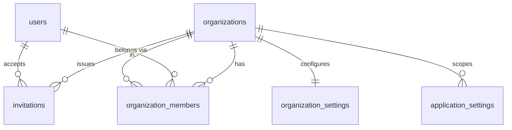
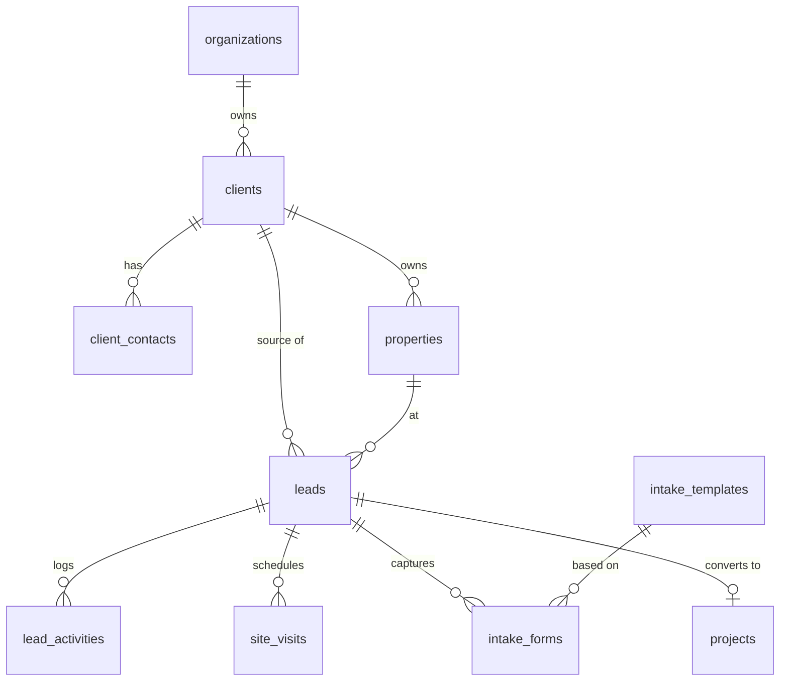
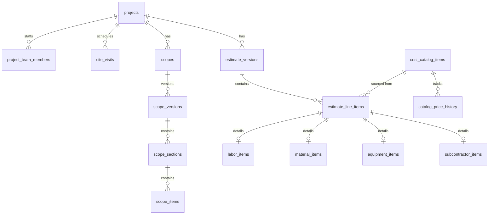
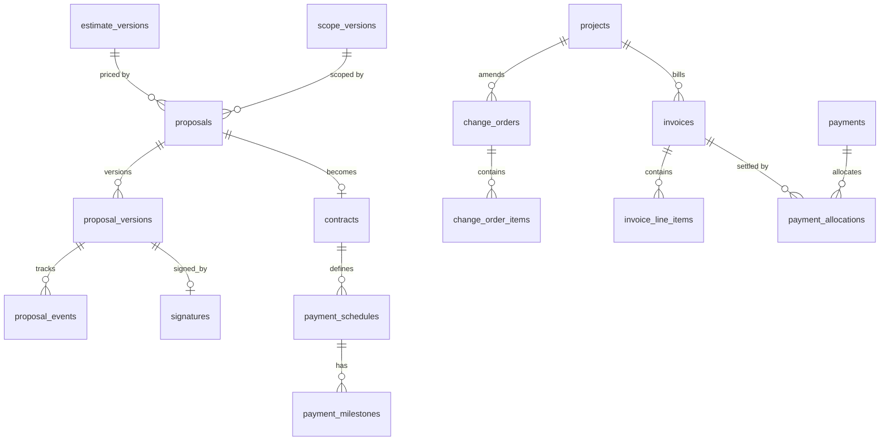
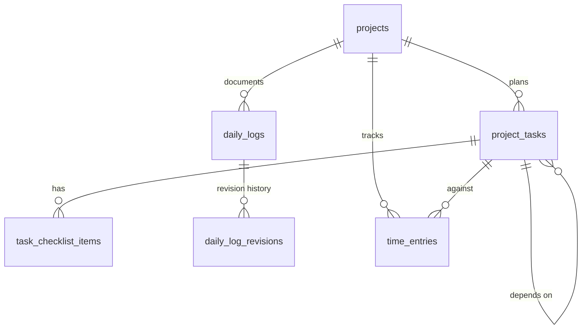
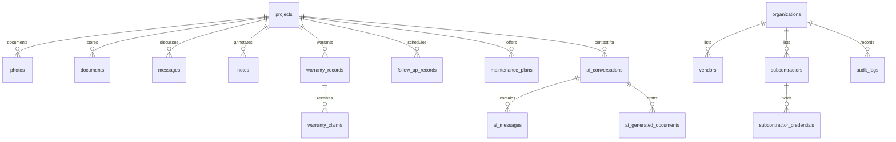

# PT's Tactical Foreman — Database Schema (Task 4)

| | |
|---|---|
| **Document version** | 1.0 |
| **Date** | 2026-07-21 |
| **Status** | Draft — pending owner approval |
| **Basis** | `docs/PRD.md`, `docs/tech-stack.md`, `docs/architecture.md` |
| **Engine** | PostgreSQL 15+ (Supabase), schema authored in Drizzle, migrations emit this SQL |

This is the relational schema for PT's Tactical Foreman. The SQL below is the authoritative artifact; Drizzle table definitions mirror it 1:1 and drizzle-kit emits it (plus the RLS policies and triggers) as migrations. It implements the architecture's binding rules: UUID keys, universal timestamps, soft delete where history matters, `organization_id` on every tenant table with RLS, versioning for scopes and estimates, and database-enforced immutability + audit for financial records.

---

## 1. Conventions (apply to every table unless noted)

| Convention | Rule |
|---|---|
| Primary key | `id uuid PRIMARY KEY DEFAULT gen_random_uuid()` |
| Tenancy | `organization_id uuid NOT NULL REFERENCES organizations(id)` on every tenant table; RLS keyed on it |
| Timestamps | `created_at timestamptz NOT NULL DEFAULT now()`, `updated_at timestamptz NOT NULL DEFAULT now()` (trigger-maintained) |
| Soft delete | `deleted_at timestamptz` where business history matters; RLS/queries exclude non-null by default |
| Actor tracking | `created_by uuid REFERENCES users(id)`, and `updated_by` where edits are audited |
| Status | Postgres enum (below) or `CHECK`-constrained text |
| Money | `numeric(14,2)` for currency, `numeric(12,4)` for rates/quantities — never floating point |
| Referential integrity | Explicit `ON DELETE` per relationship (mostly `RESTRICT`; `CASCADE` only for owned children) |
| Versioning | Estimate/scope versions are insert-only; a pointer column names the current/approved version |
| Financial immutability | Trigger rejects `UPDATE`/`DELETE` once `locked_at` is set; corrections are new linked rows |

**Shared helpers**

```sql
create extension if not exists pgcrypto;   -- gen_random_uuid()
create extension if not exists pg_trgm;     -- fuzzy search / duplicate detection

-- updated_at maintenance
create or replace function set_updated_at() returns trigger as $$
begin new.updated_at = now(); return new; end;
$$ language plpgsql;

-- immutability guard for finalized financial rows
create or replace function reject_if_locked() returns trigger as $$
begin
  if old.locked_at is not null then
    raise exception 'Record % is finalized and immutable; create a correcting record instead', old.id
      using errcode = 'restrict_violation';
  end if;
  return new;                              -- (or old for DELETE)
end;
$$ language plpgsql;
-- Applied as BEFORE UPDATE OR DELETE on invoices, payments, contracts,
-- signed proposal_versions, incorporated change_orders.

-- append-only guard for audit_logs
create or replace function reject_mutation() returns trigger as $$
begin raise exception 'append-only table'; end;
$$ language plpgsql;
```

---

## 2. Enumerated Types

```sql
create type user_role as enum ('owner','office_manager','estimator','project_manager',
  'field_foreman','technician','sales_rep','client','subcontractor');

create type lead_status as enum ('new','contacted','qualified','site_visit_scheduled',
  'estimating','proposal_sent','won','lost','on_hold');
create type priority as enum ('low','medium','high');

create type project_status as enum ('planning','scheduled','in_progress','punch_list',
  'completed','warranty','closed','on_hold','cancelled');
create type permit_status as enum ('not_required','not_started','applied','approved',
  'inspections','final_approved','closed');
create type payment_state as enum ('none','deposit_due','deposit_paid','partial','paid_in_full','overdue');

create type version_status as enum ('draft','in_review','approved','locked','superseded');

create type line_item_type as enum ('labor','material','equipment','subcontractor','allowance','other');
create type unit_of_measure as enum ('each','linear_foot','square_foot','cubic_yard',
  'hour','day','allowance','lump_sum');
create type material_tier as enum ('economic','standard','premium');

create type proposal_status as enum ('draft','sent','viewed','accepted','declined',
  'changes_requested','expired');
create type contract_status as enum ('draft','active','completed','cancelled');
create type change_order_status as enum ('draft','internal_review','sent','viewed',
  'approved','declined','incorporated','canceled');
create type invoice_status as enum ('draft','sent','viewed','partially_paid','paid','overdue','void');
create type invoice_type as enum ('deposit','milestone','progress','change_order',
  'time_materials','final','maintenance');
create type payment_method as enum ('card','ach','check','cash','other');

create type task_status as enum ('not_started','ready','in_progress','blocked',
  'awaiting_inspection','completed','rework_required');
create type time_entry_status as enum ('open','submitted','approved','rejected');

create type photo_category as enum ('before','progress','completion','damage','other');
create type document_category as enum ('receipt','plan','permit','inspection_report',
  'contract','invoice','product_spec','warranty','insurance','w9','other');

create type message_channel as enum ('in_app','email','sms');
create type notification_type as enum ('new_lead','lead_followup_due','site_visit_scheduled',
  'proposal_viewed','proposal_approved','deposit_due','task_assigned','task_overdue',
  'inspection_upcoming','change_order_pending','invoice_overdue','budget_warning','warranty_followup');

create type warranty_status as enum ('active','expired','claim_open','void');
create type follow_up_status as enum ('scheduled','completed','skipped');

create type ai_actor as enum ('user','assistant');
create type ai_draft_type as enum ('lead','client_note','scope_section','estimate_item',
  'material_list','project_task','daily_log','change_order','invoice_description',
  'client_email','project_summary');
create type ai_draft_status as enum ('draft','edited','approved','discarded');
```

---

## 3. Entity-Relationship Diagrams (by domain)

A single 50-table ERD is unreadable; the schema is shown as connected domain clusters. `organizations` is the tenant root every cluster hangs from.

### 3.1 Identity, tenancy & settings



### 3.2 CRM & intake



### 3.3 Projects, scope & estimating



### 3.4 Sales documents & financial



### 3.5 Field operations



### 3.6 Media, communication, external parties, post-project & AI



---

## 4. SQL Schema (DDL)

> Every `create table` below implies the §1 conventions. `created_at`/`updated_at` and the `set_updated_at` trigger are omitted from each listing for brevity but exist on all tables; `deleted_at` appears only where soft delete applies.

### 4.1 Identity, tenancy & settings

```sql
create table organizations (
  id uuid primary key default gen_random_uuid(),
  name text not null,
  slug text unique not null,
  logo_url text,
  tagline text default 'Your Home, Our Mission.',
  primary_color text, address jsonb, phone text, email text, website text,
  timezone text not null default 'America/New_York',
  deleted_at timestamptz,
  created_at timestamptz not null default now(),
  updated_at timestamptz not null default now()
);

create table users (                       -- app profile; auth lives in Supabase auth.users
  id uuid primary key,                      -- == auth.users.id
  email text unique not null,
  full_name text, phone text, avatar_url text,
  is_active boolean not null default true,
  last_login_at timestamptz,
  created_at timestamptz not null default now(),
  updated_at timestamptz not null default now()
);

create table organization_members (        -- a user's membership + roles in an org
  id uuid primary key default gen_random_uuid(),
  organization_id uuid not null references organizations(id) on delete cascade,
  user_id uuid not null references users(id) on delete cascade,
  roles user_role[] not null default '{}',  -- union of roles = effective permissions
  extra_permissions text[] not null default '{}',  -- Owner-granted grants beyond role
  is_active boolean not null default true,
  invited_by uuid references users(id),
  created_at timestamptz not null default now(),
  updated_at timestamptz not null default now(),
  unique (organization_id, user_id)
);

create table invitations (
  id uuid primary key default gen_random_uuid(),
  organization_id uuid not null references organizations(id) on delete cascade,
  email text not null,
  roles user_role[] not null default '{}',
  token_hash text not null,                 -- store hash, never the raw token
  status text not null default 'pending' check (status in ('pending','accepted','revoked','expired')),
  invited_by uuid references users(id),
  expires_at timestamptz not null,
  accepted_at timestamptz,
  created_at timestamptz not null default now(),
  updated_at timestamptz not null default now()
);

create table organization_settings (       -- 1:1 config bundle (Task 41)
  organization_id uuid primary key references organizations(id) on delete cascade,
  default_markup numeric(6,4) default 0.20,
  default_labor_rate numeric(12,4),
  default_payment_terms text,
  tax_rate numeric(6,4) default 0,
  proposal_terms text, contract_terms text, warranty_language text,
  preferred_vendor text default 'Lowe''s',
  material_tiers jsonb, email_defaults jsonb, notification_defaults jsonb,
  ai_settings jsonb,                        -- default model per task tier, retention, redaction
  document_numbering jsonb,                 -- prefixes/sequences for INV/PROP/CO numbers
  updated_at timestamptz not null default now()
);

create table application_settings (        -- platform/global + per-org key-value overrides
  id uuid primary key default gen_random_uuid(),
  organization_id uuid references organizations(id) on delete cascade,  -- null = global
  key text not null, value jsonb not null,
  updated_at timestamptz not null default now(),
  unique (organization_id, key)
);
```

### 4.2 CRM & intake

```sql
create table clients (
  id uuid primary key default gen_random_uuid(),
  organization_id uuid not null references organizations(id) on delete restrict,
  client_type text not null default 'individual' check (client_type in ('individual','company')),
  display_name text not null,
  company_name text,
  primary_phone text, primary_email text,
  billing_address jsonb,
  preferred_contact_method text check (preferred_contact_method in ('phone','email','text')),
  tags text[] not null default '{}',
  notes text,
  created_by uuid references users(id),
  deleted_at timestamptz,
  created_at timestamptz not null default now(),
  updated_at timestamptz not null default now()
);

create table client_contacts (
  id uuid primary key default gen_random_uuid(),
  organization_id uuid not null references organizations(id) on delete restrict,
  client_id uuid not null references clients(id) on delete cascade,
  name text not null, role text, phone text, email text,
  is_primary boolean not null default false,
  created_at timestamptz not null default now(),
  updated_at timestamptz not null default now()
);

create table properties (
  id uuid primary key default gen_random_uuid(),
  organization_id uuid not null references organizations(id) on delete restrict,
  client_id uuid not null references clients(id) on delete cascade,
  address jsonb not null,
  property_type text, square_footage integer, year_built integer,
  occupancy_status text, access_instructions text, utility_info jsonb,
  permit_jurisdiction text, notes text,
  created_at timestamptz not null default now(),
  updated_at timestamptz not null default now()
);

create table leads (
  id uuid primary key default gen_random_uuid(),
  organization_id uuid not null references organizations(id) on delete restrict,
  lead_name text not null,
  client_id uuid references clients(id),      -- null until qualified/converted
  property_id uuid references properties(id),
  contact_name text, phone text, email text, property_address jsonb,
  project_type text, lead_source text,
  estimated_budget numeric(14,2), desired_start_date date, description text,
  assigned_to uuid references users(id),       -- salesperson
  status lead_status not null default 'new',
  priority priority not null default 'medium',
  next_follow_up_date date,
  notes text,
  converted_project_id uuid,                   -- set on conversion (FK added after projects)
  created_by uuid references users(id),
  deleted_at timestamptz,
  created_at timestamptz not null default now(),
  updated_at timestamptz not null default now()
);

create table lead_activities (               -- timeline of touches
  id uuid primary key default gen_random_uuid(),
  organization_id uuid not null references organizations(id) on delete restrict,
  lead_id uuid not null references leads(id) on delete cascade,
  activity_type text not null,               -- call, email, status_change, note, ...
  summary text, metadata jsonb,
  occurred_at timestamptz not null default now(),
  created_by uuid references users(id),
  created_at timestamptz not null default now()
);

create table intake_templates (             -- per project type (bathroom, roofing, ...)
  id uuid primary key default gen_random_uuid(),
  organization_id uuid references organizations(id) on delete cascade,  -- null = global template
  name text not null, project_type text not null,
  schema jsonb not null,                     -- question groups/fields
  is_active boolean not null default true,
  created_at timestamptz not null default now(),
  updated_at timestamptz not null default now()
);

create table intake_forms (                 -- a completed/in-progress intake
  id uuid primary key default gen_random_uuid(),
  organization_id uuid not null references organizations(id) on delete restrict,
  lead_id uuid references leads(id) on delete cascade,
  project_id uuid,                           -- FK added after projects
  template_id uuid references intake_templates(id),
  answers jsonb not null default '{}',
  status text not null default 'draft' check (status in ('draft','submitted')),
  submitted_at timestamptz,
  created_by uuid references users(id),
  created_at timestamptz not null default now(),
  updated_at timestamptz not null default now()
);
```

### 4.3 Projects, team & site visits

```sql
create table projects (
  id uuid primary key default gen_random_uuid(),
  organization_id uuid not null references organizations(id) on delete restrict,
  project_number text not null,              -- org-scoped human id
  name text not null,
  client_id uuid not null references clients(id) on delete restrict,
  property_id uuid references properties(id),
  source_lead_id uuid references leads(id),
  project_manager_id uuid references users(id),
  foreman_id uuid references users(id),
  salesperson_id uuid references users(id),
  status project_status not null default 'planning',
  project_type text,
  contract_value numeric(14,2) default 0,    -- kept in sync by ChangeOrderService
  budget numeric(14,2),
  expected_start date, expected_completion date,
  actual_start date, actual_completion date,
  permit_status permit_status not null default 'not_required',
  payment_state payment_state not null default 'none',
  description text, internal_notes text,
  created_by uuid references users(id),
  deleted_at timestamptz,
  created_at timestamptz not null default now(),
  updated_at timestamptz not null default now(),
  unique (organization_id, project_number)
);

-- deferred FKs now that projects exists
alter table leads add constraint leads_converted_project_fk
  foreign key (converted_project_id) references projects(id);
alter table intake_forms add constraint intake_forms_project_fk
  foreign key (project_id) references projects(id) on delete cascade;

create table project_team_members (
  id uuid primary key default gen_random_uuid(),
  organization_id uuid not null references organizations(id) on delete restrict,
  project_id uuid not null references projects(id) on delete cascade,
  user_id uuid references users(id),
  subcontractor_id uuid,                     -- FK added after subcontractors
  role_on_project user_role,
  assigned_at timestamptz not null default now(),
  created_at timestamptz not null default now(),
  updated_at timestamptz not null default now()
);

create table site_visits (
  id uuid primary key default gen_random_uuid(),
  organization_id uuid not null references organizations(id) on delete restrict,
  lead_id uuid references leads(id) on delete cascade,
  project_id uuid references projects(id) on delete cascade,
  scheduled_at timestamptz, completed_at timestamptz,
  assigned_to uuid references users(id),
  notes text, measurements jsonb,
  google_event_id text,                      -- calendar sync mapping
  status text not null default 'scheduled' check (status in ('scheduled','completed','cancelled')),
  created_at timestamptz not null default now(),
  updated_at timestamptz not null default now()
);
```

### 4.4 Scope of work (versioned)

```sql
create table scopes (
  id uuid primary key default gen_random_uuid(),
  organization_id uuid not null references organizations(id) on delete restrict,
  project_id uuid not null references projects(id) on delete cascade,
  title text not null,
  current_version_id uuid,                   -- pointer to the active version
  approved_version_id uuid,                  -- pointer to the approved+locked version
  created_by uuid references users(id),
  created_at timestamptz not null default now(),
  updated_at timestamptz not null default now()
);

create table scope_versions (               -- insert-only; edits create new versions
  id uuid primary key default gen_random_uuid(),
  organization_id uuid not null references organizations(id) on delete restrict,
  scope_id uuid not null references scopes(id) on delete cascade,
  version_number integer not null,
  status version_status not null default 'draft',
  source text,                               -- scratch | copied | template | ai_generated
  ai_generated boolean not null default false,
  ai_generated_document_id uuid,             -- original AI output for audit
  notes text,
  locked_at timestamptz,
  approved_by uuid references users(id),
  created_by uuid references users(id),
  created_at timestamptz not null default now(),
  unique (scope_id, version_number)
);
alter table scopes add constraint scopes_current_version_fk
  foreign key (current_version_id) references scope_versions(id);
alter table scopes add constraint scopes_approved_version_fk
  foreign key (approved_version_id) references scope_versions(id);

create table scope_sections (
  id uuid primary key default gen_random_uuid(),
  organization_id uuid not null references organizations(id) on delete restrict,
  scope_version_id uuid not null references scope_versions(id) on delete cascade,
  section_type text not null,                -- included | excluded | assumption | allowance |
                                             -- alternate | client_responsibility |
                                             -- contractor_responsibility | permit | cleanup | warranty
  title text not null, sort_order integer not null default 0,
  created_at timestamptz not null default now()
);

create table scope_items (
  id uuid primary key default gen_random_uuid(),
  organization_id uuid not null references organizations(id) on delete restrict,
  scope_section_id uuid not null references scope_sections(id) on delete cascade,
  description text not null, sort_order integer not null default 0,
  created_at timestamptz not null default now()
);

create table scope_templates (              -- reusable sections/scopes for common PTTR jobs
  id uuid primary key default gen_random_uuid(),
  organization_id uuid references organizations(id) on delete cascade,  -- null = global
  name text not null, project_type text, body jsonb not null,
  is_active boolean not null default true,
  created_at timestamptz not null default now(),
  updated_at timestamptz not null default now()
);
```

### 4.5 Estimating (versioned) & cost catalog

```sql
create table estimate_versions (
  id uuid primary key default gen_random_uuid(),
  organization_id uuid not null references organizations(id) on delete restrict,
  project_id uuid not null references projects(id) on delete cascade,
  scope_version_id uuid references scope_versions(id),
  version_number integer not null,
  name text,                                  -- e.g. "Good", "Better", "Best"
  status version_status not null default 'draft',
  ai_generated boolean not null default false,
  ai_generated_document_id uuid,
  -- roll-up totals (computed by EstimateService, stored for reporting; unit-tested)
  material_subtotal numeric(14,2) default 0,
  labor_subtotal numeric(14,2) default 0,
  equipment_subtotal numeric(14,2) default 0,
  subcontractor_subtotal numeric(14,2) default 0,
  direct_cost numeric(14,2) default 0,
  overhead_amount numeric(14,2) default 0,
  profit_amount numeric(14,2) default 0,
  tax_amount numeric(14,2) default 0,
  final_price numeric(14,2) default 0,
  gross_margin_pct numeric(6,4),
  markup_pct numeric(6,4),
  overhead_pct numeric(6,4), profit_pct numeric(6,4), tax_rate numeric(6,4),
  locked_at timestamptz, approved_by uuid references users(id),
  created_by uuid references users(id),
  created_at timestamptz not null default now(),
  unique (project_id, version_number)
);

create table cost_catalog_items (
  id uuid primary key default gen_random_uuid(),
  organization_id uuid references organizations(id) on delete cascade,  -- null = global template
  name text not null, trade text, description text,
  unit unit_of_measure not null default 'each',
  default_material_cost numeric(12,4) default 0,
  default_labor_hours numeric(12,4) default 0,
  default_labor_rate numeric(12,4) default 0,
  equipment_cost numeric(12,4) default 0,
  waste_pct numeric(6,4) default 0,
  vendor text, vendor_item_number text, region text,
  tier material_tier default 'standard',
  last_verified_date date,
  is_active boolean not null default true,
  notes text,
  created_at timestamptz not null default now(),
  updated_at timestamptz not null default now()
);

create table catalog_price_history (
  id uuid primary key default gen_random_uuid(),
  organization_id uuid references organizations(id) on delete cascade,
  catalog_item_id uuid not null references cost_catalog_items(id) on delete cascade,
  material_cost numeric(12,4), labor_rate numeric(12,4),
  effective_date date not null default current_date,
  source text,
  created_at timestamptz not null default now()
);

create table estimate_line_items (          -- common fields; subtype details in child tables
  id uuid primary key default gen_random_uuid(),
  organization_id uuid not null references organizations(id) on delete restrict,
  estimate_version_id uuid not null references estimate_versions(id) on delete cascade,
  catalog_item_id uuid references cost_catalog_items(id),
  category text, description text not null,
  line_type line_item_type not null,
  quantity numeric(12,4) not null default 1,
  unit unit_of_measure not null default 'each',
  waste_factor_pct numeric(6,4) default 0,
  taxable boolean not null default true,
  -- computed roll-up for the line
  line_cost numeric(14,2) default 0,
  line_price numeric(14,2) default 0,
  sort_order integer not null default 0,
  -- AI provenance (Task 16): every AI item shows source, assumption, confidence, approval
  ai_generated boolean not null default false,
  ai_source text, ai_is_assumption boolean, ai_confidence numeric(4,3), ai_approved boolean,
  created_at timestamptz not null default now(),
  updated_at timestamptz not null default now()
);

-- Detail tables: each 0..1 per line item, per the master-instruction table list.
create table labor_items (
  id uuid primary key default gen_random_uuid(),
  organization_id uuid not null references organizations(id) on delete restrict,
  line_item_id uuid not null unique references estimate_line_items(id) on delete cascade,
  labor_hours numeric(12,4) not null default 0,
  labor_rate numeric(12,4) not null default 0,
  labor_markup_pct numeric(6,4) default 0,
  crew_size integer
);
create table material_items (
  id uuid primary key default gen_random_uuid(),
  organization_id uuid not null references organizations(id) on delete restrict,
  line_item_id uuid not null unique references estimate_line_items(id) on delete cascade,
  material_unit_cost numeric(12,4) not null default 0,
  material_markup_pct numeric(6,4) default 0,
  tier material_tier default 'standard',
  vendor text, vendor_item_number text
);
create table equipment_items (
  id uuid primary key default gen_random_uuid(),
  organization_id uuid not null references organizations(id) on delete restrict,
  line_item_id uuid not null unique references estimate_line_items(id) on delete cascade,
  equipment_cost numeric(12,4) not null default 0,
  rental_duration numeric(12,4), duration_unit unit_of_measure
);
create table subcontractor_items (
  id uuid primary key default gen_random_uuid(),
  organization_id uuid not null references organizations(id) on delete restrict,
  line_item_id uuid not null unique references estimate_line_items(id) on delete cascade,
  subcontractor_id uuid,                     -- FK added after subcontractors
  subcontractor_cost numeric(14,2) not null default 0,
  markup_pct numeric(6,4) default 0
);
```

### 4.6 Proposals, contracts, payment schedules & signatures

```sql
create table proposals (
  id uuid primary key default gen_random_uuid(),
  organization_id uuid not null references organizations(id) on delete restrict,
  project_id uuid not null references projects(id) on delete cascade,
  proposal_number text not null,
  estimate_version_id uuid references estimate_versions(id),
  scope_version_id uuid references scope_versions(id),
  current_version_id uuid,
  status proposal_status not null default 'draft',
  expires_at timestamptz,
  created_by uuid references users(id),
  created_at timestamptz not null default now(),
  updated_at timestamptz not null default now(),
  unique (organization_id, proposal_number)
);

create table proposal_versions (            -- each generated PDF is a version
  id uuid primary key default gen_random_uuid(),
  organization_id uuid not null references organizations(id) on delete restrict,
  proposal_id uuid not null references proposals(id) on delete cascade,
  version_number integer not null,
  pdf_document_id uuid,                      -- FK to documents (generated PDF)
  content_snapshot jsonb,                    -- client-safe view model at issue time
  secure_link_token_hash text,
  locked_at timestamptz,                     -- immutable once signed
  created_by uuid references users(id),
  created_at timestamptz not null default now(),
  unique (proposal_id, version_number)
);
alter table proposals add constraint proposals_current_version_fk
  foreign key (current_version_id) references proposal_versions(id);

create table proposal_events (              -- delivery/engagement audit
  id uuid primary key default gen_random_uuid(),
  organization_id uuid not null references organizations(id) on delete restrict,
  proposal_version_id uuid not null references proposal_versions(id) on delete cascade,
  event_type text not null,                  -- sent | viewed | accepted | declined | changes_requested | reminder
  actor_email text, ip_address inet, user_agent text, metadata jsonb,
  occurred_at timestamptz not null default now()
);

create table signatures (                   -- e-signature capture (Task 19)
  id uuid primary key default gen_random_uuid(),
  organization_id uuid not null references organizations(id) on delete restrict,
  signable_type text not null,               -- 'proposal_version' | 'change_order' | 'contract'
  signable_id uuid not null,
  signer_name text not null, signer_email text,
  signature_image_url text,
  signed_at timestamptz not null default now(),
  ip_address inet, user_agent text,
  disclosure_text text,                      -- jurisdiction disclosure shown at signing
  locked_at timestamptz not null default now(),
  created_at timestamptz not null default now()
);

create table contracts (
  id uuid primary key default gen_random_uuid(),
  organization_id uuid not null references organizations(id) on delete restrict,
  project_id uuid not null references projects(id) on delete cascade,
  proposal_id uuid references proposals(id),
  contract_number text not null,
  status contract_status not null default 'draft',
  contract_value numeric(14,2) not null default 0,
  pdf_document_id uuid,
  signed_signature_id uuid references signatures(id),
  locked_at timestamptz,                     -- immutable once active/signed
  created_by uuid references users(id),
  created_at timestamptz not null default now(),
  updated_at timestamptz not null default now(),
  unique (organization_id, contract_number)
);

create table payment_schedules (
  id uuid primary key default gen_random_uuid(),
  organization_id uuid not null references organizations(id) on delete restrict,
  contract_id uuid not null references contracts(id) on delete cascade,
  structure_type text not null,              -- fixed | percentage | 75_25 | milestone | time_materials | maintenance
  created_at timestamptz not null default now(),
  updated_at timestamptz not null default now()
);

create table payment_milestones (
  id uuid primary key default gen_random_uuid(),
  organization_id uuid not null references organizations(id) on delete restrict,
  payment_schedule_id uuid not null references payment_schedules(id) on delete cascade,
  name text not null, sort_order integer not null default 0,
  amount numeric(14,2), percentage numeric(6,4),
  trigger_type text,                         -- deposit | date | milestone | final
  due_date date, invoice_id uuid,
  created_at timestamptz not null default now(),
  updated_at timestamptz not null default now()
);
```

### 4.7 Change orders & financial (immutable)

```sql
create table change_orders (
  id uuid primary key default gen_random_uuid(),
  organization_id uuid not null references organizations(id) on delete restrict,
  project_id uuid not null references projects(id) on delete cascade,
  change_order_number text not null,
  requested_by text, reason text,
  cost_change numeric(14,2) not null default 0,
  schedule_change_days integer default 0,
  internal_notes text, client_explanation text,
  status change_order_status not null default 'draft',
  approved_at timestamptz, signature_id uuid references signatures(id),
  locked_at timestamptz,                     -- immutable once incorporated
  created_by uuid references users(id),
  created_at timestamptz not null default now(),
  updated_at timestamptz not null default now(),
  unique (organization_id, change_order_number)
);

create table change_order_items (
  id uuid primary key default gen_random_uuid(),
  organization_id uuid not null references organizations(id) on delete restrict,
  change_order_id uuid not null references change_orders(id) on delete cascade,
  direction text not null check (direction in ('added','removed')),
  description text not null,
  amount numeric(14,2) not null default 0,
  created_at timestamptz not null default now()
);

create table invoices (
  id uuid primary key default gen_random_uuid(),
  organization_id uuid not null references organizations(id) on delete restrict,
  project_id uuid not null references projects(id) on delete cascade,
  client_id uuid not null references clients(id) on delete restrict,
  invoice_number text not null,
  invoice_type invoice_type not null,
  milestone_id uuid references payment_milestones(id),
  change_order_id uuid references change_orders(id),
  status invoice_status not null default 'draft',
  subtotal numeric(14,2) not null default 0,
  tax_amount numeric(14,2) not null default 0,
  credits numeric(14,2) not null default 0,
  total numeric(14,2) not null default 0,
  amount_paid numeric(14,2) not null default 0,   -- maintained via payment_allocations
  balance numeric(14,2) not null default 0,
  due_date date, payment_instructions text,
  pdf_document_id uuid,
  locked_at timestamptz,                     -- immutable once issued (non-draft)
  created_by uuid references users(id),
  created_at timestamptz not null default now(),
  updated_at timestamptz not null default now(),
  unique (organization_id, invoice_number)
);

create table invoice_line_items (
  id uuid primary key default gen_random_uuid(),
  organization_id uuid not null references organizations(id) on delete restrict,
  invoice_id uuid not null references invoices(id) on delete cascade,
  description text not null,
  quantity numeric(12,4) default 1, unit_price numeric(14,2) default 0,
  amount numeric(14,2) not null default 0,
  taxable boolean not null default true,
  sort_order integer not null default 0,
  created_at timestamptz not null default now()
);

create table payments (
  id uuid primary key default gen_random_uuid(),
  organization_id uuid not null references organizations(id) on delete restrict,
  project_id uuid references projects(id),
  client_id uuid references clients(id),
  amount numeric(14,2) not null,
  payment_date date not null default current_date,
  method payment_method not null,
  reference_number text,                      -- check #, Stripe payment intent, etc.
  processor_fee numeric(14,2) default 0,
  is_refund boolean not null default false,
  notes text,
  external_id text,                           -- Stripe id; unique for idempotency
  locked_at timestamptz,                      -- immutable once finalized
  created_by uuid references users(id),
  created_at timestamptz not null default now(),
  updated_at timestamptz not null default now(),
  unique (organization_id, external_id)
);

create table payment_allocations (          -- apply a payment across invoices/milestones
  id uuid primary key default gen_random_uuid(),
  organization_id uuid not null references organizations(id) on delete restrict,
  payment_id uuid not null references payments(id) on delete restrict,
  invoice_id uuid not null references invoices(id) on delete restrict,
  amount numeric(14,2) not null,
  locked_at timestamptz,
  created_at timestamptz not null default now()
);
```

### 4.8 Field operations

```sql
create table project_tasks (
  id uuid primary key default gen_random_uuid(),
  organization_id uuid not null references organizations(id) on delete restrict,
  project_id uuid not null references projects(id) on delete cascade,
  title text not null, description text,
  assignee_id uuid references users(id),
  crew_id uuid,                              -- optional crew grouping
  priority priority not null default 'medium',
  status task_status not null default 'not_started',
  start_date date, due_date date,
  estimated_hours numeric(12,4), actual_hours numeric(12,4),
  completion_verified_by uuid references users(id),
  supervisor_approved_by uuid references users(id),
  sort_order integer not null default 0,
  created_by uuid references users(id),
  deleted_at timestamptz,
  created_at timestamptz not null default now(),
  updated_at timestamptz not null default now()
);

create table task_dependencies (
  id uuid primary key default gen_random_uuid(),
  organization_id uuid not null references organizations(id) on delete restrict,
  task_id uuid not null references project_tasks(id) on delete cascade,
  depends_on_task_id uuid not null references project_tasks(id) on delete cascade,
  unique (task_id, depends_on_task_id),
  check (task_id <> depends_on_task_id)
);

create table task_checklist_items (
  id uuid primary key default gen_random_uuid(),
  organization_id uuid not null references organizations(id) on delete restrict,
  task_id uuid not null references project_tasks(id) on delete cascade,
  label text not null, is_done boolean not null default false,
  sort_order integer not null default 0,
  created_at timestamptz not null default now()
);

create table daily_logs (
  id uuid primary key default gen_random_uuid(),
  organization_id uuid not null references organizations(id) on delete restrict,
  project_id uuid not null references projects(id) on delete cascade,
  log_date date not null,
  crew_present text, subs_present text,
  work_completed text, materials_delivered text, equipment_used text,
  weather text, delays text, problems text,
  client_conversations text, safety_incidents text, inspection_activity text,
  work_planned_tomorrow text,
  editable_until timestamptz,                 -- controlled edit window
  created_by uuid references users(id),
  created_at timestamptz not null default now(),
  updated_at timestamptz not null default now()
);

create table daily_log_revisions (          -- preserve revision history
  id uuid primary key default gen_random_uuid(),
  organization_id uuid not null references organizations(id) on delete restrict,
  daily_log_id uuid not null references daily_logs(id) on delete cascade,
  snapshot jsonb not null,
  edited_by uuid references users(id),
  created_at timestamptz not null default now()
);

create table time_entries (
  id uuid primary key default gen_random_uuid(),
  organization_id uuid not null references organizations(id) on delete restrict,
  user_id uuid not null references users(id) on delete restrict,
  project_id uuid references projects(id),
  task_id uuid references project_tasks(id),
  clock_in timestamptz, clock_out timestamptz,
  break_minutes integer default 0,
  hours numeric(12,4),                        -- derived; validated no overlap
  is_manual boolean not null default false,
  status time_entry_status not null default 'open',
  corrected_by uuid references users(id), approved_by uuid references users(id),
  notes text,
  created_at timestamptz not null default now(),
  updated_at timestamptz not null default now(),
  -- prevent overlapping entries per user (needs btree_gist)
  exclude using gist (
    user_id with =,
    tstzrange(clock_in, coalesce(clock_out, 'infinity')) with &&
  ) where (clock_in is not null and status <> 'rejected')
);
```

### 4.9 Media, documents, communication

```sql
create table photos (
  id uuid primary key default gen_random_uuid(),
  organization_id uuid not null references organizations(id) on delete restrict,
  project_id uuid references projects(id) on delete cascade,
  storage_path text not null, thumbnail_path text,
  category photo_category not null default 'progress',
  caption text,
  geolocation jsonb, taken_at timestamptz,
  client_visible boolean not null default false,
  uploaded_by uuid references users(id),
  deleted_at timestamptz,
  created_at timestamptz not null default now(),
  updated_at timestamptz not null default now()
);

create table documents (
  id uuid primary key default gen_random_uuid(),
  organization_id uuid not null references organizations(id) on delete restrict,
  project_id uuid references projects(id) on delete cascade,
  storage_path text not null,
  file_name text not null, mime_type text, size_bytes bigint,
  category document_category not null default 'other',
  is_generated boolean not null default false,   -- true for system PDFs
  client_visible boolean not null default false,
  uploaded_by uuid references users(id),
  deleted_at timestamptz,
  created_at timestamptz not null default now(),
  updated_at timestamptz not null default now()
);
-- wire generated-PDF FKs
alter table proposal_versions add constraint pv_pdf_fk foreign key (pdf_document_id) references documents(id);
alter table contracts add constraint contract_pdf_fk foreign key (pdf_document_id) references documents(id);
alter table invoices add constraint invoice_pdf_fk foreign key (pdf_document_id) references documents(id);

create table messages (
  id uuid primary key default gen_random_uuid(),
  organization_id uuid not null references organizations(id) on delete restrict,
  project_id uuid references projects(id) on delete cascade,
  thread_key text,
  sender_id uuid references users(id),
  audience text not null default 'internal' check (audience in ('internal','client','subcontractor')),
  channel message_channel not null default 'in_app',
  body text not null,
  approved_by uuid references users(id),      -- client-facing sends require approval
  sent_at timestamptz,
  created_at timestamptz not null default now(),
  updated_at timestamptz not null default now()
);

create table notes (
  id uuid primary key default gen_random_uuid(),
  organization_id uuid not null references organizations(id) on delete restrict,
  entity_type text not null, entity_id uuid not null,   -- polymorphic (project, client, lead...)
  body text not null, is_internal boolean not null default true,
  created_by uuid references users(id),
  deleted_at timestamptz,
  created_at timestamptz not null default now(),
  updated_at timestamptz not null default now()
);

create table communication_templates (      -- Task 34
  id uuid primary key default gen_random_uuid(),
  organization_id uuid references organizations(id) on delete cascade,
  name text not null, template_type text not null, subject text, body text not null,
  is_active boolean not null default true,
  created_at timestamptz not null default now(),
  updated_at timestamptz not null default now()
);

create table email_log (                     -- Gmail metadata (Task 35) — minimal content
  id uuid primary key default gen_random_uuid(),
  organization_id uuid not null references organizations(id) on delete restrict,
  project_id uuid references projects(id), client_id uuid references clients(id),
  gmail_message_id text, subject text,
  to_addresses text[], cc_addresses text[], bcc_addresses text[],
  status text not null default 'sent' check (status in ('draft','sent','failed')),
  error text, sent_by uuid references users(id),
  sent_at timestamptz,
  created_at timestamptz not null default now()
);

create table notifications (
  id uuid primary key default gen_random_uuid(),
  organization_id uuid not null references organizations(id) on delete restrict,
  user_id uuid not null references users(id) on delete cascade,
  type notification_type not null,
  title text not null, body text,
  entity_type text, entity_id uuid,
  read_at timestamptz,
  emailed boolean not null default false,
  created_at timestamptz not null default now()
);

create table notification_preferences (
  id uuid primary key default gen_random_uuid(),
  organization_id uuid not null references organizations(id) on delete restrict,
  user_id uuid not null references users(id) on delete cascade,
  type notification_type not null,
  in_app boolean not null default true, email boolean not null default false,
  unique (user_id, type)
);
```

### 4.10 External parties

```sql
create table vendors (
  id uuid primary key default gen_random_uuid(),
  organization_id uuid not null references organizations(id) on delete cascade,
  name text not null, contact_name text, phone text, email text,
  is_preferred boolean not null default false,
  notes text, deleted_at timestamptz,
  created_at timestamptz not null default now(),
  updated_at timestamptz not null default now()
);

create table subcontractors (
  id uuid primary key default gen_random_uuid(),
  organization_id uuid not null references organizations(id) on delete cascade,
  company_name text not null, trade text,
  contact_name text, phone text, email text,
  user_id uuid references users(id),          -- portal login, if provisioned
  notes text, deleted_at timestamptz,
  created_at timestamptz not null default now(),
  updated_at timestamptz not null default now()
);
-- wire deferred subcontractor FKs
alter table project_team_members add constraint ptm_sub_fk
  foreign key (subcontractor_id) references subcontractors(id);
alter table subcontractor_items add constraint sub_item_sub_fk
  foreign key (subcontractor_id) references subcontractors(id);

create table subcontractor_credentials (    -- insurance/W-9 with expiry (Task 39)
  id uuid primary key default gen_random_uuid(),
  organization_id uuid not null references organizations(id) on delete restrict,
  subcontractor_id uuid not null references subcontractors(id) on delete cascade,
  credential_type text not null,             -- insurance | w9 | license | bond
  document_id uuid references documents(id),
  issued_date date, expiration_date date,
  status text not null default 'valid' check (status in ('valid','expiring','expired')),
  created_at timestamptz not null default now(),
  updated_at timestamptz not null default now()
);
```

### 4.11 Post-project

```sql
create table warranty_records (
  id uuid primary key default gen_random_uuid(),
  organization_id uuid not null references organizations(id) on delete restrict,
  project_id uuid not null references projects(id) on delete cascade,
  starts_on date, expires_on date,
  covered_work text, excluded_work text,
  status warranty_status not null default 'active',
  created_at timestamptz not null default now(),
  updated_at timestamptz not null default now()
);

create table warranty_claims (
  id uuid primary key default gen_random_uuid(),
  organization_id uuid not null references organizations(id) on delete restrict,
  warranty_record_id uuid not null references warranty_records(id) on delete cascade,
  reported_by text, description text,
  status text not null default 'open' check (status in ('open','scheduled','resolved','denied')),
  inspection_date date, resolution text, resolved_at timestamptz,
  created_at timestamptz not null default now(),
  updated_at timestamptz not null default now()
);

create table follow_up_records (
  id uuid primary key default gen_random_uuid(),
  organization_id uuid not null references organizations(id) on delete restrict,
  project_id uuid references projects(id) on delete cascade,
  lead_id uuid references leads(id) on delete cascade,
  follow_up_type text,                       -- estimate | completion | review_request | warranty
  due_date date, status follow_up_status not null default 'scheduled',
  assigned_to uuid references users(id), notes text,
  completed_at timestamptz,
  created_at timestamptz not null default now(),
  updated_at timestamptz not null default now()
);

create table maintenance_plans (
  id uuid primary key default gen_random_uuid(),
  organization_id uuid not null references organizations(id) on delete restrict,
  client_id uuid not null references clients(id) on delete cascade,
  project_id uuid references projects(id),
  name text not null, cadence text,          -- monthly | quarterly | annual
  next_service_date date, price numeric(14,2),
  is_active boolean not null default true,
  created_at timestamptz not null default now(),
  updated_at timestamptz not null default now()
);
```

### 4.12 AI

```sql
create table ai_conversations (
  id uuid primary key default gen_random_uuid(),
  organization_id uuid not null references organizations(id) on delete restrict,
  user_id uuid not null references users(id) on delete cascade,
  project_id uuid references projects(id),    -- context selector
  title text, model text,
  created_at timestamptz not null default now(),
  updated_at timestamptz not null default now()
);

create table ai_messages (
  id uuid primary key default gen_random_uuid(),
  organization_id uuid not null references organizations(id) on delete restrict,
  conversation_id uuid not null references ai_conversations(id) on delete cascade,
  role ai_actor not null,
  content text not null,
  attachments jsonb,                          -- referenced doc/photo ids
  token_usage jsonb,
  created_at timestamptz not null default now()
);

create table ai_generated_documents (       -- preserved original AI output (audit)
  id uuid primary key default gen_random_uuid(),
  organization_id uuid not null references organizations(id) on delete restrict,
  conversation_id uuid references ai_conversations(id),
  draft_type ai_draft_type not null,
  raw_output jsonb not null,                  -- exactly what the model produced
  validated_output jsonb,                     -- Zod-validated structured form
  status ai_draft_status not null default 'draft',
  linked_entity_type text, linked_entity_id uuid,   -- what it became once approved
  reviewed_by uuid references users(id), approved_at timestamptz,
  created_by uuid references users(id),
  created_at timestamptz not null default now(),
  updated_at timestamptz not null default now()
);
-- wire AI-provenance FKs on versioned artifacts
alter table scope_versions add constraint sv_ai_doc_fk
  foreign key (ai_generated_document_id) references ai_generated_documents(id);
alter table estimate_versions add constraint ev_ai_doc_fk
  foreign key (ai_generated_document_id) references ai_generated_documents(id);

create table ai_activity_log (               -- every AI access/action (Task 31)
  id uuid primary key default gen_random_uuid(),
  organization_id uuid not null references organizations(id) on delete restrict,
  user_id uuid references users(id),
  conversation_id uuid references ai_conversations(id),
  action text not null,                       -- context_fetch | draft | approve | discard
  permitted_scope jsonb,                      -- what the permission gate allowed
  metadata jsonb,
  created_at timestamptz not null default now()
);
```

### 4.13 Audit (append-only)

```sql
create table audit_logs (
  id uuid primary key default gen_random_uuid(),
  organization_id uuid not null references organizations(id) on delete restrict,
  user_id uuid references users(id),
  action text not null,                       -- create | update | status_change | approve | sign | ...
  record_type text not null, record_id uuid,
  before_value jsonb, after_value jsonb,
  ip_address inet, session_id text,
  created_at timestamptz not null default now()
);
create trigger audit_logs_no_update before update on audit_logs
  for each row execute function reject_mutation();
create trigger audit_logs_no_delete before delete on audit_logs
  for each row execute function reject_mutation();
```

---

## 5. Table Descriptions (summary)

| Table | Purpose |
|---|---|
| organizations / organization_settings / application_settings | Tenant root; per-org branding, defaults, terms, numbering; global/per-org key-values |
| users / organization_members / invitations | App profiles (mirror of Supabase auth), multi-role membership, pending invites |
| clients / client_contacts / properties | CRM: individuals or companies, their contacts, and one or more properties |
| leads / lead_activities | Pipeline records with status/priority/follow-up and a per-lead activity timeline |
| intake_templates / intake_forms | Per-project-type guided intake definitions and captured (draft-capable) answers |
| projects / project_team_members / site_visits | Job workspace, staffing (users + subs), and scheduled/completed visits |
| scopes / scope_versions / scope_sections / scope_items / scope_templates | Versioned scope of work; sections by type (included/excluded/allowance/…); reusable templates |
| estimate_versions / estimate_line_items / labor_/material_/equipment_/subcontractor_items | Versioned estimates with roll-up totals; common line fields plus per-type cost details |
| cost_catalog_items / catalog_price_history | Reusable catalog (org + global), material tiers, price-history tracking |
| proposals / proposal_versions / proposal_events / signatures | Versioned client proposals, delivery/engagement audit, e-signature records |
| contracts / payment_schedules / payment_milestones | Contract generated from a proposal; deposit/milestone/draw structures |
| change_orders / change_order_items | Formal change process; approved orders update contract/budget/schedule |
| invoices / invoice_line_items / payments / payment_allocations | Provider-independent ledger; payments allocate across invoices; immutable once finalized |
| project_tasks / task_dependencies / task_checklist_items | Field tasks with statuses, dependencies, checklists, verification/approval |
| daily_logs / daily_log_revisions | Field logs with controlled edit window and preserved revision history |
| time_entries | Clock in/out with overlap prevention and approval workflow |
| photos / documents | Media and files with category, visibility flags, and Storage paths |
| messages / notes / communication_templates / email_log | Project comms, polymorphic notes, templates, Gmail send metadata |
| notifications / notification_preferences | In-app/email notifications with per-user, per-type preferences |
| vendors / subcontractors / subcontractor_credentials | External parties; sub insurance/W-9 with expiry tracking |
| warranty_records / warranty_claims / follow_up_records / maintenance_plans | Post-project warranty, claims, follow-ups, recurring service |
| ai_conversations / ai_messages / ai_generated_documents / ai_activity_log | AI Foreman chat, preserved raw+validated drafts, and access/action logging |
| audit_logs | Append-only record of significant activity with before/after and session metadata |

---

## 6. Key Relationship Explanations

- **Everything hangs off `organizations`.** Every tenant table carries `organization_id`; this is the RLS anchor and the reason cross-tenant leakage is structurally impossible when policies are correct.
- **Lead → Project conversion.** `leads.converted_project_id` links a won lead to the `projects` row it became; intake, site visits, and follow-ups can attach to either the lead or the project so nothing is orphaned at conversion.
- **Versioning is pointer-based.** `scopes`/`proposals` keep `current_version_id` (+ `approved_version_id`) rather than mutating a row; `scope_versions`/`estimate_versions`/`proposal_versions` are insert-only and locked on approval. This gives the PRD's "create multiple versions, compare, lock approved" behavior with a clean audit trail.
- **Estimate line items + detail tables.** `estimate_line_items` holds the common fields (qty, unit, waste, roll-ups, AI provenance); `labor_items`/`material_items`/`equipment_items`/`subcontractor_items` each hold 0..1 rows of type-specific cost inputs. A single installed-item line can therefore carry both labor and material details, and the four explicit tables from the spec exist for reporting and clarity.
- **Money flows one direction and is immutable.** Approved `change_orders` adjust `projects.contract_value`, budget, and `payment_milestones` (in one transaction via `ChangeOrderService`). `invoices` draw from milestones/change orders; `payments` allocate across invoices through `payment_allocations`. Once `locked_at` is set, the immutability trigger blocks edits — corrections are new linked rows.
- **Signatures are polymorphic.** One `signatures` table serves proposals, change orders, and contracts via `signable_type`/`signable_id`, capturing signer, timestamp, IP, and the disclosure text shown at signing.
- **AI provenance is first-class.** `ai_generated_documents.raw_output` preserves exactly what the model produced; `validated_output` is the schema-checked form; `linked_entity_*` records what it became after human approval. `scope_versions`/`estimate_versions` reference it so any AI-originated artifact is traceable.
- **Documents are the storage-metadata layer.** Generated PDFs (proposals, contracts, invoices) point at `documents` rows; the binary lives in Supabase Storage. Visibility flags on `photos`/`documents` gate portal access.

---

## 7. Index Recommendations

**Tenancy + soft delete (every tenant table).**
```sql
create index on <table> (organization_id);
create index on <table> (organization_id) where deleted_at is null;  -- where soft-deleted
```

**Foreign keys** — index every FK column used in joins (Postgres does not auto-index FKs): `client_id`, `property_id`, `project_id`, `lead_id`, `scope_version_id`, `estimate_version_id`, `invoice_id`, `payment_id`, `task_id`, `subcontractor_id`, etc.

**Hot query paths.**
```sql
-- pipeline & follow-ups
create index on leads (organization_id, status, next_follow_up_date);
create index on leads (organization_id, assigned_to) where deleted_at is null;
-- project workspace & scheduling
create index on projects (organization_id, status);
create index on project_tasks (organization_id, project_id, status);
create index on project_tasks (assignee_id, status) where deleted_at is null;
create index on site_visits (organization_id, scheduled_at);
-- financial dashboards / A-R
create index on invoices (organization_id, status, due_date);
create index on payment_allocations (invoice_id);
create index on payments (organization_id, payment_date);
-- versioned artifacts (fetch current/approved fast)
create index on scope_versions (scope_id, version_number desc);
create index on estimate_versions (project_id, version_number desc);
create index on proposal_versions (proposal_id, version_number desc);
-- time tracking & logs
create index on time_entries (user_id, clock_in);
create index on daily_logs (organization_id, project_id, log_date desc);
-- media
create index on photos (organization_id, project_id, category);
create index on documents (organization_id, project_id, category);
-- audit & AI
create index on audit_logs (organization_id, record_type, record_id, created_at desc);
create index on ai_activity_log (organization_id, created_at desc);
-- notifications
create index on notifications (user_id, read_at, created_at desc);
```

**Uniqueness / integrity.**
```sql
create unique index on organizations (slug);
create unique index on organization_members (organization_id, user_id);
-- org-scoped human numbers already enforced via UNIQUE (organization_id, *_number)
create unique index on payments (organization_id, external_id);  -- Stripe idempotency
```

**Search / duplicate detection (pg_trgm).**
```sql
create index on clients using gin (display_name gin_trgm_ops);         -- fuzzy client search
create index on clients using gin (primary_email gin_trgm_ops);         -- duplicate detection
create index on cost_catalog_items using gin (name gin_trgm_ops);       -- catalog search
create index on properties using gin ((address->>'line1') gin_trgm_ops);
```

**Overlap prevention.** `time_entries` uses a GiST exclusion constraint (requires `btree_gist`) to block overlapping clock-in ranges per user — an index-backed integrity rule, not just a query index.

---

## 8. Row-Level Security Recommendations

RLS is the primary tenant/role boundary (per the architecture). Enable it on **every tenant table** and default-deny.

**8.1 Session context.** Supabase sets `auth.uid()`; the app also exposes the active org and roles. Two helper functions read them from JWT claims:
```sql
create or replace function current_org() returns uuid language sql stable as $$
  select nullif(current_setting('request.jwt.claims', true)::jsonb->>'org','')::uuid;
$$;
create or replace function current_roles() returns text[] language sql stable as $$
  select coalesce(
    array(select jsonb_array_elements_text(current_setting('request.jwt.claims', true)::jsonb->'roles')),
    '{}');
$$;
```

**8.2 Baseline tenant policy (apply to every tenant table).**
```sql
alter table <table> enable row level security;
alter table <table> force row level security;   -- applies even to table owner

create policy tenant_isolation on <table>
  using (organization_id = current_org())
  with check (organization_id = current_org());
```
This alone guarantees no row from another organization is ever readable or writable, regardless of app-code mistakes.

**8.3 Role- and assignment-scoped read policies (layered on the tenant policy).**
- **Internal staff (owner/office/estimator/PM/sales):** the tenant policy is sufficient for most tables; PMs/foremen are additionally narrowed on project-scoped tables to assigned projects:
  ```sql
  create policy assigned_projects_only on project_tasks for select
    using (
      organization_id = current_org()
      and ('owner' = any(current_roles()) or 'office_manager' = any(current_roles())
           or exists (select 1 from project_team_members m
                      where m.project_id = project_tasks.project_id
                        and m.user_id = auth.uid()))
    );
  ```
- **Field roles (foreman/technician):** may read scope/schedule/tasks on assigned projects but **not** cost/margin. Enforce financial hiding by (a) not granting these roles `select` on `estimate_*`, `invoices`, `payments`, `payment_allocations`, and (b) serving them project financials only through role-scoped **views** that omit cost/margin columns.
- **Technicians:** own `time_entries`, assigned `project_tasks`, and their own uploads only:
  ```sql
  create policy own_time on time_entries for all
    using (organization_id = current_org()
           and (user_id = auth.uid() or 'owner' = any(current_roles())
                or 'project_manager' = any(current_roles())));
  ```

**8.4 Portal policies (clients & subcontractors — strict).**
- **Clients** see only their own projects and only client-visible artifacts:
  ```sql
  create policy client_portal_projects on projects for select
    using (
      organization_id = current_org()
      and 'client' = any(current_roles())
      and client_id in (select c.id from clients c where c.portal_user_id = auth.uid())
    );
  create policy client_visible_photos on photos for select
    using (organization_id = current_org()
           and 'client' = any(current_roles())
           and client_visible = true
           and project_id in (/* client's projects subquery */));
  ```
  Clients get **no** policy granting `select` on `estimate_*`, internal `notes` (`is_internal = true`), `messages` with `audience = 'internal'`, `ai_*`, subcontractor tables, or `audit_logs`.
- **Subcontractors** see only assigned projects, assigned scope, schedule, and their own uploads/invoices; policies join through `project_team_members`/`subcontractor_items` on `subcontractor_id`.

**8.5 Sensitive-table policies.**
- **`audit_logs`:** `select` policy restricted to `'owner' = any(current_roles())`; no `update`/`delete` policy at all (plus the append-only triggers). Insert only via the service role used by `AuditService`.
- **`ai_generated_documents` / `ai_activity_log`:** readable by internal staff within org; never by portal roles.
- **Financial immutability** is enforced by triggers (§1), independent of RLS, so even a permitted role cannot rewrite a locked invoice/payment/contract.

**8.6 Storage RLS.** Supabase Storage policies mirror these rules on object paths (`org/{orgId}/project/{projectId}/…`): a request must resolve to a permitted org+project, and portal roles additionally require the corresponding `photos`/`documents` row to be `client_visible = true`.

**8.7 Testing mandate.** Per PRD acceptance criteria #3–5, every RLS policy set is covered by automated cross-tenant and cross-role tests from Task 6 onward: a user in org A must get zero rows from org B; a foreman must get zero cost/margin columns; a client must get zero other-client projects. These tests are part of the Task 44 suite and re-run in CI.

---

## 9. Testing / Validation of This Schema

- **Reviewed** for referential-integrity ordering (deferred FKs for the circular `leads↔projects`, `scopes↔scope_versions`, `proposals↔proposal_versions`, `documents↔generated PDFs`, `subcontractors↔items` relationships) so migrations apply in a valid sequence.
- **Not yet executed** against a live database — no environment is provisioned at this design phase (Task 5 scaffolds the app and Supabase). The DDL is written to standard PostgreSQL 15 syntax; `EXCLUDE USING gist` needs `btree_gist`, and `pgcrypto`/`pg_trgm` extensions are declared. When Task 5 stands up Supabase, this schema is translated to Drizzle and applied via migration, at which point it is exercised by the seed script and the Task 44 tests. No results are claimed here that have not been run.

---

## 10. Decision Requested

Approve this schema so Task 5 can scaffold the app and translate it into Drizzle migrations. The consequential modeling choices are: **pointer-based versioning** for scopes/estimates/proposals, **estimate line items with four typed detail tables**, **a single polymorphic `signatures` table**, **a provider-independent invoice/payment/allocation ledger with trigger-enforced immutability**, and **RLS as the primary isolation boundary with financial hiding via role-scoped views**. Flag any table or field you want added, split, or renamed before it becomes migration code.
